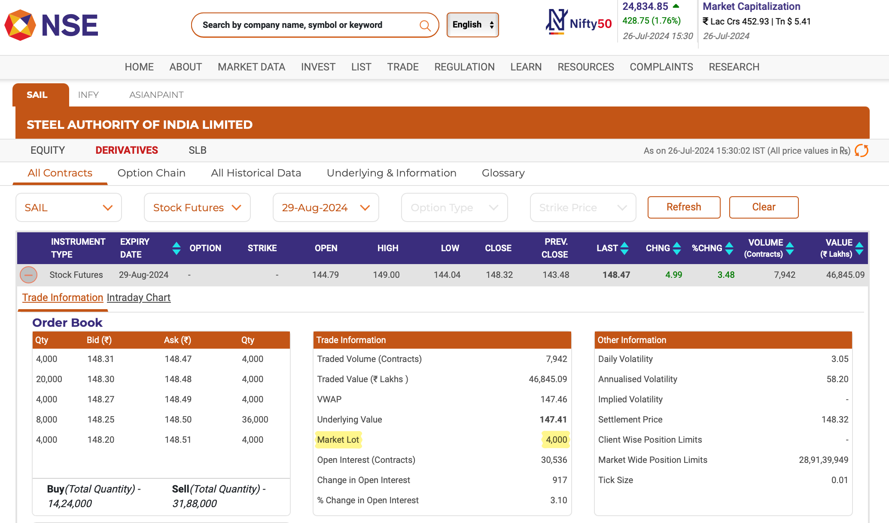

# Futures Position and Margin Management Tool

This is a Python-based tool for calculating margin values and handling margin calls on futures data from NSE India.
## Run Locally

Clone the project

```bash
  git clone https://github.com/vineetmehtaa/Futures-Position-and-Margin-Management-Tool.git
```

Go to the project directory

```bash
  cd my-project
```

Install dependencies

```bash
  pip install -r requirements.txt
```

Download the necessary data from NSE and run the code.
```bash
  python3 FuturesPositionAndMarginManagementTool.py
```
## Demo

1. After downloading the repository, visit the [NSE website](https://www.nseindia.com) to find a stock futures contract for a company of your choice. For demonstration, let's use [STEEL AUTHORITY OF INDIA LIMITED (INE114A01011)](https://www.nseindia.com/get-quotes/equity?symbol=SAIL).

2. Under derivatives, find a contract of your choice and note down the `Market Lot`.


3. Download the historical data for that contract for your desired time period, and also find the `Open Price` of the first day of the contract and note it down.


4. Open the CSV file, convert it to a .xlsx format, rename it to `Data.xlsx`, and save it in the same folder of the downloaded repository.

5. Under the equity section, locate the information icon next to `Applicable Margin Rate`. Click on it to find values of `VaR Margin` and `Applicable Margin Rate`, and note it down.


6. You can now run the code using your code editor while loading the folder containing the repository, or execute the following command within the repository:
```
python3 FuturesPositionAndMarginManagementTool.py
```

7. You will see a popup requesting the necessary information you noted earlier. Enter this information and click `Submit`.


8. The following files will be generated: one for the `short position`, one for the `long position`, and `FSD_Output.xlsx`, which combines both workbooks.


9. You will receive raw, unformatted Excel files as output, which will look something like this:


However, you can format these files quickly to achieve an output like this or according to your preferences:


10. To use the program again, simply run it once more. Note that the existing data in the files will be overwritten, so it’s recommended to move the files to another location or manually delete them to avoid losing any important information.
## License

Distributed under the MIT License. See `LICENSE.txt` for more information.
